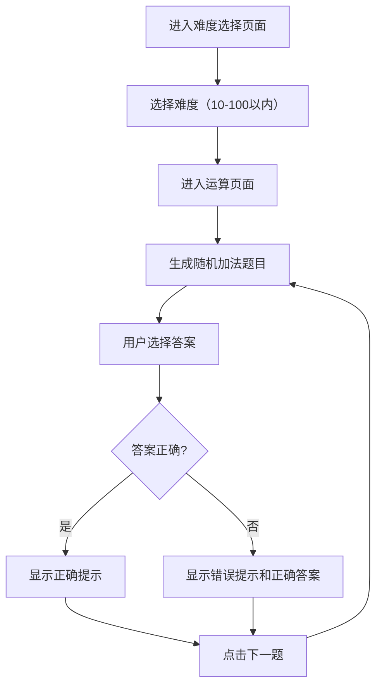

## 1. Product Overview
一个面向5-7岁小朋友的数字加法运算教育游戏，通过有趣的界面和互动方式帮助儿童学习加法运算。

## 2. Core Features

### 2.1 Feature Module
1. **难度选择页面**: 提供10以内、20以内到100以内共10个难度选项
2. **加法运算页面**: 根据选择的难度随机生成两个数字，用户选择正确答案

### 2.2 Page Details
| Page Name | Module Name | Feature description |
|-----------|-------------|---------------------|
| 难度选择页面 | 难度选择按钮 | 显示10个难度按钮，用户点击选择进入运算页面 |
| 加法运算页面 | 题目展示 | 随机显示两个数字的加法题目 |
| 加法运算页面 | 答案选择 | 显示1到所选难度范围内的数字供用户选择 |
| 加法运算页面 | 结果反馈 | 正确显示鼓励提示，错误显示正确答案 |
| 加法运算页面 | 下一题 | 点击重新生成新题目 |

## 3. Core Process
用户进入难度选择页面 → 选择难度 → 进入运算页面 → 系统生成两个随机数 → 用户选择答案 → 正确/错误反馈 → 点击下一题循环

## 4. User Interface Design

### 4.1 Design Style
- **主色调**: 明亮活泼的黄色、橙色、蓝色渐变，适合儿童视觉
- **按钮风格**: 圆角、卡通风格、3D立体效果
- **字体**: 圆润可爱的卡通字体，大号数字便于识别
- **布局**: 简洁清晰，内容居中，触控友好
- **装饰元素**: 星星、云朵、笑脸等可爱元素

### 4.2 Page Design Overview

#### 难度选择页面
| Module Name | UI Elements |
|-------------|-------------|
| 标题区域 | 大号卡通字体标题"数学小天才"，带星星装饰 |
| 难度按钮 | 10个圆角按钮，每行2-3个，彩色渐变，悬停放大效果 |
| 背景 | 浅蓝色渐变背景，底部有卡通图案装饰 |

#### 加法运算页面
| Module Name | UI Elements |
|-------------|-------------|
| 返回按钮 | 左上角返回箭头，方便回到选择页 |
| 题目区域 | 两个大数字显示，中间加号，下方等号和问号 |
| 答案按钮 | 数字按钮网格布局，按难度显示1-N的数字 |
| 反馈区域 | 正确显示绿色笑脸和鼓励语，错误显示红色和正确答案 |
| 下一题按钮 | 卡通风格按钮，点击重新生成题目 |

### 4.3 Responsiveness
- 移动端优先设计
- 触控友好的大按钮（最小44px）
- 自适应布局，适配各种屏幕尺寸

### 4.4 交互设计
- 按钮点击有动画效果（弹跳、缩放）
- 正确答案有庆祝动画（星星闪烁）
- 错误答案有轻微抖动提示