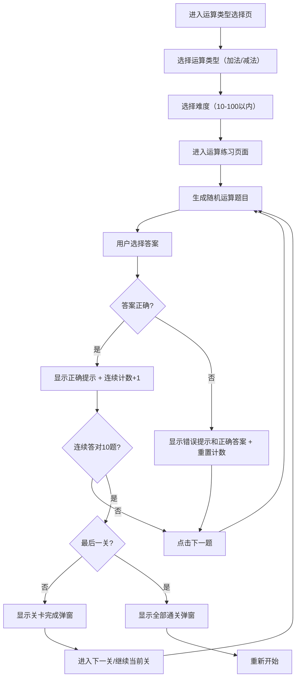

## 1. Product Overview
一个面向5-7岁小朋友的数字运算教育游戏，支持加法和减法两种运算类型，通过有趣的界面和互动方式帮助儿童学习数学运算。

## 2. Core Features

### 2.1 Feature Module
1. **运算类型选择**: 提供加法和减法两种运算类型选择
2. **难度选择页面**: 提供10以内、20以内到100以内共10个难度选项
3. **运算练习页面**: 根据选择的运算类型和难度随机生成题目，用户选择正确答案
4. **关卡系统**: 每关连续答对10题可通关，通关后可选择进入下一关或继续练习当前关卡
5. **答案解析**: 提供图形化答案解析，用方块直观展示运算过程

### 2.2 Page Details
| Page Name | Module Name | Feature description |
|-----------|-------------|---------------------|
| 运算类型选择页 | 运算类型按钮 | 显示"加法"和"减法"两个按钮，用户点击选择运算类型 |
| 难度选择页面 | 难度选择按钮 | 显示10个难度按钮（10以内到100以内），用户点击选择进入运算页面 |
| 运算练习页面 | 题目展示 | 随机显示两个数字的加法/减法题目，等号和问号在同一行水平对齐 |
| 运算练习页面 | 进度显示 | 显示"连续答对: X/10"的进度提示 |
| 运算练习页面 | 答案选择 | 固定显示10个数字选项供用户选择，选中后问号替换为正确答案并显示颜色反馈（正确绿色、错误红色） |
| 运算练习页面 | 结果反馈 | 正确显示鼓励提示和随机表情，错误显示正确答案 |
| 运算练习页面 | 解析答案 | 一直显示在选项下方，点击弹出图形化解析弹窗，直观展示运算过程 |
| 运算练习页面 | 音效播放 | 正确答案播放欢快上升音调，错误答案播放低沉下降音调 |
| 运算练习页面 | 音效开关 | 右上角显示音效开关按钮，可随时打开或关闭音效 |
| 运算练习页面 | 下一题 | 点击重新生成新题目 |
| 关卡完成弹窗 | 关卡完成提示 | 连续答对10题后弹出，可选择进入下一关或继续练习 |
| 全部通关弹窗 | 通关提示 | 完成最后一关后弹出，可选择重新开始 |

### 2.3 关卡系统
- 每关需要连续答对10题才能通关
- 答错题会重置连续答对计数
- 通关后可根据选择进入下一关或继续练习当前关卡
- 完成最后一关（100以内）后显示全部通关提示

## 3. Core Process
用户进入运算类型选择页 → 选择运算类型（加法/减法） → 选择难度 → 进入运算练习页面 → 系统生成随机题目 → 用户选择答案 → 正确/错误反馈 → 点击下一题循环



## 4. User Interface Design

### 4.1 Design Style
- **主色调**: 明亮活泼的黄色、橙色、蓝色渐变，适合儿童视觉
- **按钮风格**: 圆角、卡通风格、3D立体效果
- **字体**: 圆润可爱的卡通字体，大号数字便于识别
- **布局**: 简洁清晰，内容居中，触控友好
- **装饰元素**: 星星、云朵、笑脸等可爱元素

### 4.2 Page Design Overview

#### 运算类型选择页面
| Module Name | UI Elements |
|-------------|-------------|
| 标题区域 | 大号卡通字体标题"数学小天才"，带星星装饰 |
| 运算类型按钮 | 两个大按钮，"加法"（蓝紫渐变）和"减法"（绿青渐变），悬停放大效果 |
| 背景 | 浅蓝色渐变背景，底部有卡通图案装饰 |

#### 难度选择页面
| Module Name | UI Elements |
|-------------|-------------|
| 返回按钮 | 左上角返回箭头，可返回运算类型选择 |
| 标题区域 | 显示"加法练习"或"减法练习"，带星星装饰 |
| 难度按钮 | 10个圆角按钮，每行2个，彩色渐变，悬停放大效果 |
| 背景 | 浅蓝色渐变背景，底部有卡通图案装饰 |

#### 运算练习页面
| Module Name | UI Elements |
|-------------|-------------|
| 返回按钮 | 左上角返回箭头，方便回到难度选择页 |
| 音效开关 | 右上角音效按钮（🔊开启/🔇关闭），点击切换音效状态 |
| 标题区域 | 显示难度名称（如"10以内加法"）和连续答对进度 |
| 题目展示 | 两个大数字显示，中间加减号，等号和问号在同一行水平对齐，选中后问号替换为正确答案（正确绿色、错误红色） |
| 答案按钮 | 固定10个数字按钮，2行5列网格布局 |
| 反馈区域 | 正确显示绿色鼓励语和随机表情，错误显示红色和正确答案 |
| 解析按钮 | 一直显示在选项下方，紫色渐变按钮，点击弹出答案解析弹窗 |
| 下一题按钮 | 卡通风格圆形按钮，点击重新生成题目 |

#### 答案解析弹窗
| Module Name | UI Elements |
|-------------|-------------|
| 弹窗标题 | "答案解析" |
| 算式显示 | 大字显示完整算式（如"3 + 2 = 5"） |
| 加法解析 | 左侧显示第一个加数（蓝色方块），右侧显示第二个加数（绿色方块），底部显示合并结果（紫色方块） |
| 减法解析 | 显示被减数（蓝色方块），减去数量（绿色方块），剩下结果（紫色方块） |
| 关闭按钮 | 蓝紫渐变按钮，点击关闭弹窗 |

#### 关卡完成弹窗
| Module Name | UI Elements |
|-------------|-------------|
| 弹窗标题 | "太棒了！" + 表情 |
| 提示内容 | "你已连续答对 10 题，完成 X 以内关卡！" |
| 继续练习按钮 | 灰色按钮，点击继续当前关卡练习 |
| 进入下一关按钮 | 蓝紫渐变按钮，点击进入下一难度关卡 |

#### 全部通关弹窗
| Module Name | UI Elements |
|-------------|-------------|
| 弹窗标题 | "恭喜通关！" + 奖杯表情 |
| 提示内容 | "你已完成所有关卡，真是太厉害了！" |
| 重新开始按钮 | 绿青渐变按钮，点击从第一关重新开始 |

### 4.3 Responsiveness
- 移动端优先设计
- 触控友好的大按钮（最小44px）
- 自适应布局，适配各种屏幕尺寸
- 响应式字体大小和间距

### 4.4 交互设计
- 按钮点击有动画效果（弹跳、缩放）
- 正确答案有庆祝动画（星星闪烁、弹跳）
- 错误答案有抖动提示
- 数字按钮逐个弹出动画
- 解析弹窗中的方块逐个出现动画

## 5. Technical Specifications

### 5.1 Routing Structure
- `/` - 运算类型选择页面（DifficultySelect）
- `/game` - 加法练习页面（MathGame）
- `/subtraction` - 减法练习页面（SubtractionGame）

### 5.2 Key Components
| Component | Purpose |
|-----------|---------|
| DifficultyButton | 难度选择按钮 |
| QuestionDisplay | 运算题目展示 |
| NumberButton | 答案数字按钮 |
| FeedbackMessage | 结果反馈提示 |
| LevelCompleteMessage | 关卡完成弹窗 |
| GameCompleteMessage | 全部通关弹窗 |
| AnswerExplanation | 答案解析弹窗 |

### 5.3 Data Models
```typescript
interface DifficultyOption {
  label: string      // 如"10以内"
  value: number     // 如10
  color: string      // 按钮颜色类名
}

interface GameState {
  num1: number
  num2: number
  correctAnswer: number
  selectedAnswer: number | null
  isCorrect: boolean | null
  showFeedback: boolean
  options: number[]           // 固定10个选项
  correctCount: number        // 连续答对计数
  showLevelComplete: boolean
  showGameComplete: boolean
}
```

### 5.4 Game Logic
- **加法生成**: 生成num1(1到maxSum-1)和num2(1到maxSum-num1)，result = num1 + num2
- **减法生成**: 生成result(1到maxResult-1)和num1(result+1到maxResult)，num2 = num1 - result
- **选项生成**: 正确答案 + 9个随机错误答案，共10个选项，随机排序
- **通关判定**: 连续答对10题触发关卡完成，答错重置计数
- **音效播放**: 正确答案播放C5-E5-G5上升音调，错误答案播放G4-F4-D4下降音调
- **音效控制**: 全局音效开关状态，可随时切换，关闭时不播放任何音效
