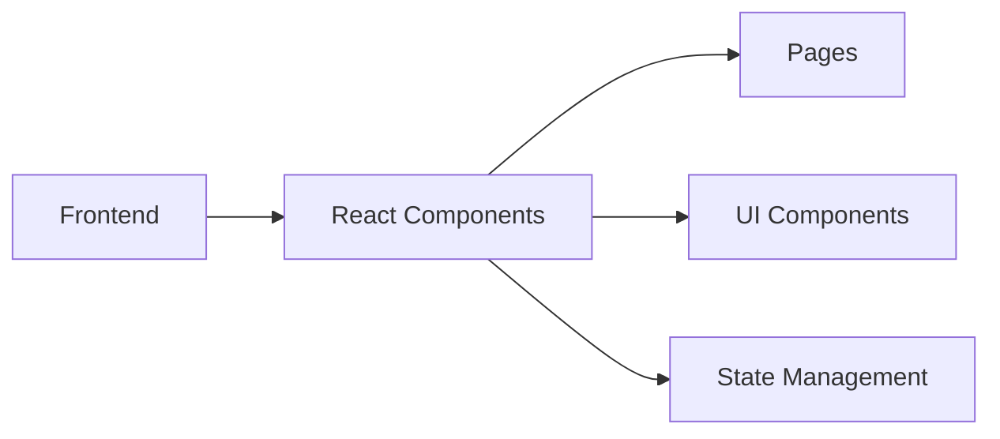

## 1. Architecture Design


## 2. Technology Description
- Frontend: React@18 + tailwindcss@3 + vite
- Initialization Tool: vite-init (react-ts template)
- Backend: None (纯前端应用)
- Routing: react-router-dom

## 3. Route Definitions
| Route | Purpose | Component |
|-------|---------|-----------|
| / | 难度选择页面 | DifficultySelect |
| /game | 加法运算页面 | MathGame |

## 4. API Definitions
无后端API，纯前端逻辑

## 5. Component Structure
```
src/
├── pages/
│   ├── DifficultySelect.tsx    # 难度选择页面
│   └── MathGame.tsx           # 加法运算页面
├── components/
│   ├── DifficultyButton.tsx   # 难度按钮组件
│   ├── NumberButton.tsx       # 数字选择按钮
│   ├── QuestionDisplay.tsx    # 题目展示组件
│   └── FeedbackMessage.tsx    # 反馈消息组件
├── hooks/
│   └── useMathGame.ts         # 游戏逻辑Hook
├── utils/
│   └── mathUtils.ts           # 数学工具函数
├── App.tsx                    # 主应用组件
└── main.tsx                   # 入口文件
```

## 6. State Management
使用React useState管理页面状态，无需复杂状态管理库

### 6.1 DifficultySelect State
- 难度选项列表

### 6.2 MathGame State
- num1: 第一个随机数
- num2: 第二个随机数
- answer: 用户选择的答案
- correctAnswer: 正确答案
- isCorrect: 是否正确
- showFeedback: 是否显示反馈
- difficulty: 当前难度

## 7. Data Model
无需数据库，纯前端生成随机数据

## 8. 核心逻辑

### 8.1 难度配置
| 难度 | 范围 | 数字1范围 | 数字2范围 |
|------|------|-----------|-----------|
| 10以内 | 1-10 | 1-9 | 1-9 |
| 20以内 | 1-20 | 1-19 | 1-19 |
| 30以内 | 1-30 | 1-29 | 1-29 |
| ... | ... | ... | ... |
| 100以内 | 1-100 | 1-99 | 1-99 |

### 8.2 随机数生成规则
- 两个数字之和不超过所选难度上限
- 每个数字范围：1到(难度上限-1)