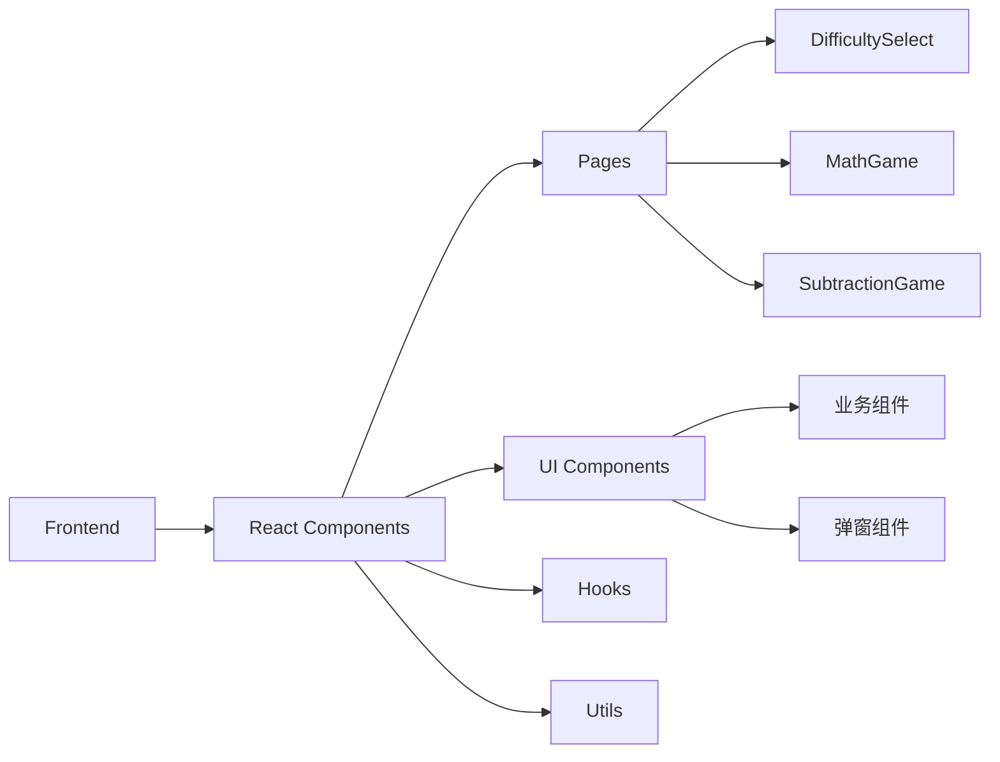

## 1. Architecture Design


## 2. Technology Description
- Frontend: React@18 + tailwindcss@3 + vite
- Initialization Tool: vite-init (react-ts template)
- Backend: None (纯前端应用)
- Routing: react-router-dom

## 3. Route Definitions
| Route | Purpose | Component |
|-------|---------|-----------|
| / | 运算类型选择页面 | DifficultySelect |
| /game | 加法运算页面 | MathGame |
| /subtraction | 减法运算页面 | SubtractionGame |

## 4. API Definitions
无后端API，纯前端逻辑

## 5. Component Structure
```
src/
├── pages/
│   ├── DifficultySelect.tsx    # 运算类型选择 + 难度选择页面
│   ├── MathGame.tsx            # 加法运算页面
│   └── SubtractionGame.tsx     # 减法运算页面
├── components/
│   ├── DifficultyButton.tsx    # 难度按钮组件
│   ├── NumberButton.tsx        # 数字选择按钮
│   ├── QuestionDisplay.tsx     # 题目展示组件（支持+和-）
│   ├── FeedbackMessage.tsx     # 反馈消息组件
│   ├── LevelCompleteMessage.tsx # 关卡完成弹窗
│   ├── GameCompleteMessage.tsx # 全部通关弹窗
│   └── AnswerExplanation.tsx   # 答案解析弹窗
├── hooks/
│   ├── useMathGame.ts          # 加法游戏Hook
│   └── useSubtractionGame.ts    # 减法游戏Hook
├── utils/
│   └── mathUtils.ts             # 数学工具函数
├── App.tsx                      # 主应用组件
├── main.tsx                     # 入口文件
└── index.css                   # 全局样式
```

## 6. State Management
使用React useState管理页面状态，无需复杂状态管理库

### 6.1 DifficultySelect State
- operationType: 'addition' | 'subtraction' | null（当前选择的运算类型）

### 6.2 MathGame / SubtractionGame State
| State | Type | Description |
|-------|------|-------------|
| num1 | number | 第一个随机数 |
| num2 | number | 第二个随机数 |
| correctAnswer | number | 正确答案 |
| selectedAnswer | number \| null | 用户选择的答案 |
| isCorrect | boolean \| null | 是否正确 |
| showFeedback | boolean | 是否显示反馈 |
| options | number[] | 固定10个选项 |
| correctCount | number | 连续答对计数 |
| showLevelComplete | boolean | 是否显示关卡完成弹窗 |
| showGameComplete | boolean | 是否显示全部通关弹窗 |

## 7. Data Model
无需数据库，纯前端生成随机数据

### 7.1 DifficultyOption
```typescript
interface DifficultyOption {
  label: string      // 如"10以内"
  value: number     // 如10
  color: string      // 按钮颜色类名
}
```

### 7.2 Difficulty Options
| label | value | color |
|-------|-------|-------|
| 10以内 | 10 | bg-red-400 |
| 20以内 | 20 | bg-orange-400 |
| 30以内 | 30 | bg-amber-400 |
| 40以内 | 40 | bg-yellow-400 |
| 50以内 | 50 | bg-lime-400 |
| 60以内 | 60 | bg-green-400 |
| 70以内 | 70 | bg-emerald-400 |
| 80以内 | 80 | bg-teal-400 |
| 90以内 | 90 | bg-cyan-400 |
| 100以内 | 100 | bg-blue-400 |

## 8. Core Logic

### 8.1 加法生成规则
```
生成 num1: 1 到 (maxSum - 1) 的随机数
生成 num2: 1 到 (maxSum - num1) 的随机数
result = num1 + num2（确保 result <= maxSum）
```

### 8.2 减法生成规则
```
生成 result: 1 到 (maxResult - 1) 的随机数（结果）
生成 num1: (result + 1) 到 maxResult 的随机数（被减数）
num2 = num1 - result（确保 num2 >= 1）
```

### 8.3 选项生成规则
```
生成10个不重复的选项
包含1个正确答案
包含9个1到难度上限范围内的随机错误答案
选项随机排序
```

### 8.4 关卡系统规则
```
每关需要连续答对10题才能通关
答错题立即重置连续答对计数为0
通关后可选择进入下一关或继续练习当前关卡
完成最后一关（100以内）后显示全部通关提示
```

## 9. Answer Explanation Graphics

### 9.1 加法解析
```
左侧: num1个蓝色方块（第一个加数）
右侧: num2个绿色方块（第二个加数）
底部: result个紫色方块（合并结果）
```

### 9.2 减法解析
```
第一行: num1个蓝色方块（被减数）
第二行: num2个绿色方块（减去的数量）
第三行: result个紫色方块（剩下的数量）
```

## 10. Animation Effects

### 10.1 Button Animations
- pop-in: 元素逐个弹出动画
- hover:scale-105: 悬停放大效果
- transition-all: 平滑过渡

### 10.2 Feedback Animations
- animate-bounce: 正确答案弹跳
- animate-shake: 错误答案抖动
- animate-pop: 方块弹出

### 10.3 CSS Animations (index.css)
```css
@keyframes pop-in: 弹出动画
@keyframes float: 漂浮动画
@keyframes bounce-in: 弹跳进入
@keyframes shake: 抖动
```
